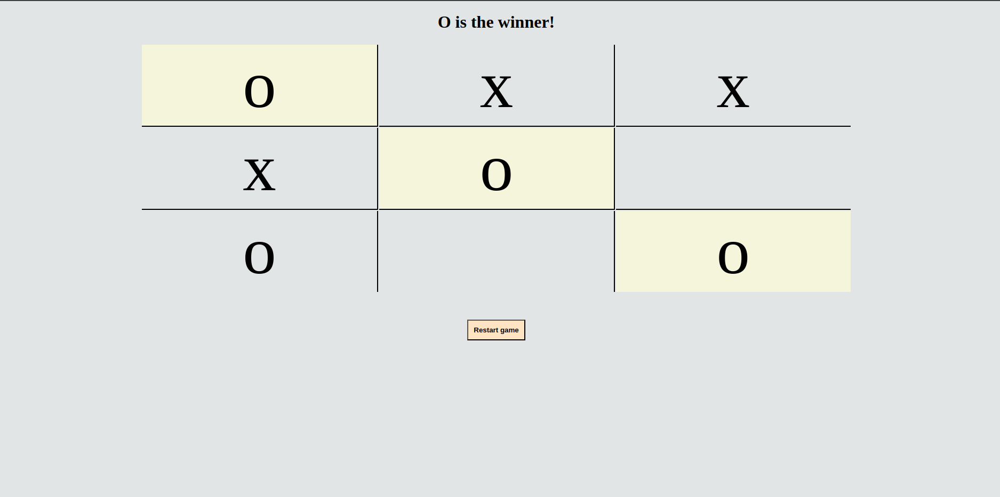

# Tic-Tac-Toe

  

GitHub Repo: https://github.com/RubinoD1/Tic-Tac-Toe

## About 

A Tic Tac Toe game built using JavaScript. 

The user turn is defaulted to "o" and the cpu is "x". 

## Screenshots 

